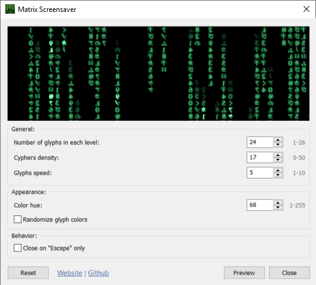

# Matrix Screensaver


The Matrix ScreenSaver is a small, fast and elegant Windows version of the
green "Matrix" cypher-code seen in the films.



## Building

A [devcontainer](containers.dev) is provided to simplify building. It uses Mono
to build the Visual Studio solution. Alternatively you can use Visual Studio
itself.

From the container:

```sh
msbuild matrix.sln -p:Configuration=Release
```

## License and authors

Originally written by J Brown 2003.

Website: [www.henrypp.org](https://www.henrypp.org)

Support: support@henrypp.org

(c) 2011-2021 Henry++
